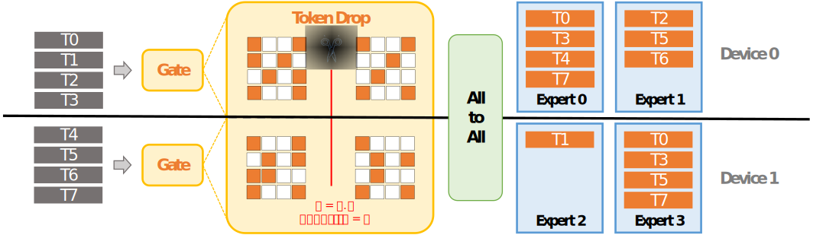
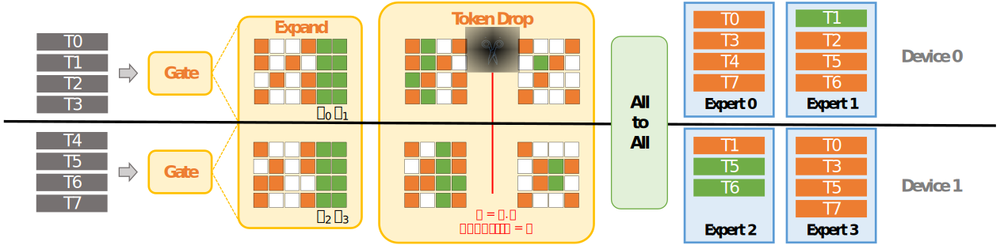

# **Capacity-Aware Inference: Mitigating the Straggler Effect in Mixture of Experts**

This repository contains the official implementation of our work **“Capacity-Aware Inference”**, which investigates test-time load balancing in **Mixture of Experts (MoE)** and proposes efficient inference algorithms to alleviate the *straggler effect*.

<p align="center">
  
</p>

---

## 🔍 Overview

The **Mixture of Experts (MoE)** architecture scales large language models by activating only a sparse subset of experts per input, effectively improving efficiency without sacrificing capacity.  
However, during inference under **expert parallelism**, MoE models suffer from **load imbalance** — some experts process far more tokens than others. As a result, the faster, underloaded experts must wait for the slowest, overloaded ones to finish, leading to a **global delay**, which we term the **Straggler Effect**.

To address this issue, we introduce two complementary inference strategies:

1. **Capacity-Aware Token Drop** — Enforces expert capacity limits by dropping excess tokens from overloaded experts, effectively reducing load imbalance with negligible performance loss (e.g., *30% speedup with only 0.9% degradation on OLMoE*).  
2. **Capacity-Aware Expanded Drop** — Further enhances utilization by expanding token routing to nearby low-load experts before applying local capacity constraints, leading to more balanced expert workloads and improved inference efficiency.

Extensive experiments on both **language** and **multimodal** MoE models validate our approach, showing substantial improvements in expert utilization, throughput, and model performance.  
For example, applying Expanded Drop to **Mixtral-8×7B-Instruct** achieves a *1.85× inference speedup* with a *0.2% average performance gain*.

<table align="center">
  <tr>
    <td align="center" width="50%">
      <br>
      <em><b>Token Drop:</b> Tokens exceeding expert capacity are dropped to mitigate overload and reduce straggler effects.</em>
    </td>
    <td align="center" width="50%">
      <br>
      <em><b>Expanded Drop:</b> Tokens are allowed to expand to additional low-load experts before enforcing capacity limits.</em>
    </td>
  </tr>
</table>

---

## ⚙️ Requirements

To install dependencies:

```bash
pip install -r requirements.txt
```

---

## 🚀 Usage

We provide minimal working examples based on **Hugging Face Transformers** modeling files.  
For system-level integration and large-scale deployment, please refer to the [**Megatron-LM**](https://github.com/NVIDIA/Megatron-LM) framework.

---

## 📊 Evaluation

Evaluation can be conducted using:
- **[lm-evaluation-harness](https://github.com/EleutherAI/lm-evaluation-harness)** for language benchmarks  
- **[VLMEvalKit](https://github.com/open-compass/VLMEvalKit)** for multimodal benchmarks  

We modify their inference logic to incorporate **capacity-aware routing** under varying capacity factors.

---

## 📄 Citation

If you find this work useful, please cite:

```bibtex
@misc{he2025capacityawareinferencemitigatingstraggler,
      title={Capacity-Aware Inference: Mitigating the Straggler Effect in Mixture of Experts},
      author={Shwai He and Weilin Cai and Jiayi Huang and Ang Li},
      year={2025},
      eprint={2503.05066},
      archivePrefix={arXiv},
      primaryClass={cs.LG},
      url={https://arxiv.org/abs/2503.05066},
}
```
