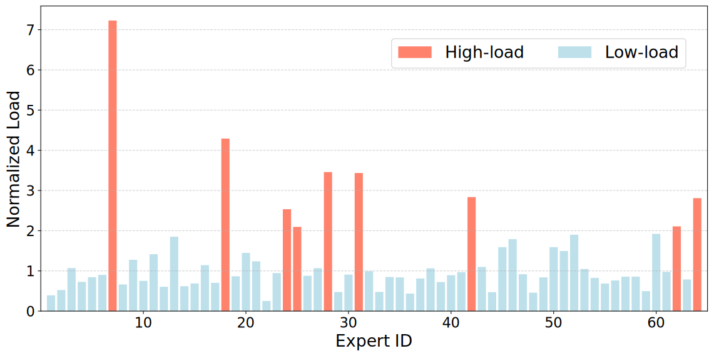
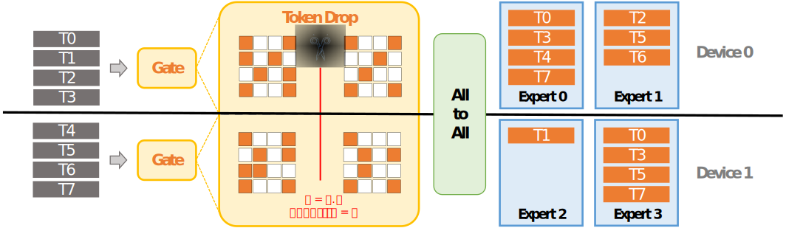
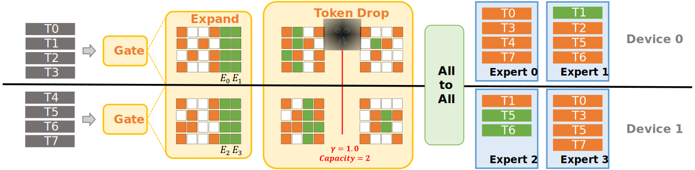
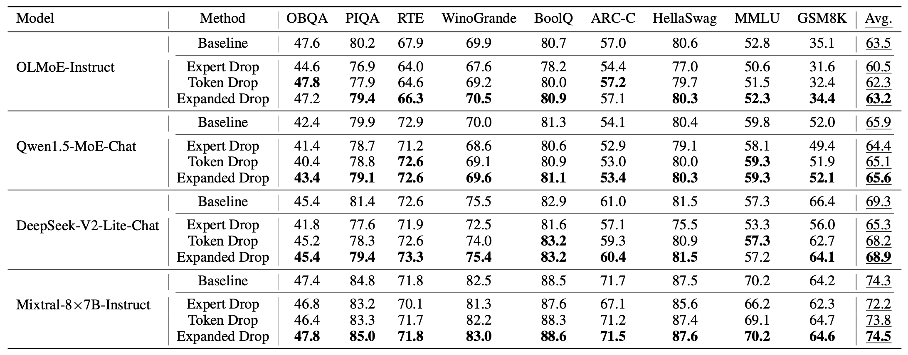
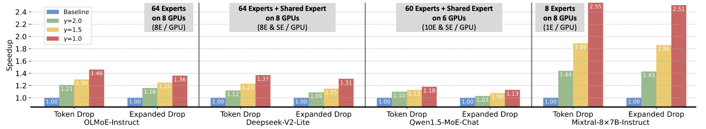
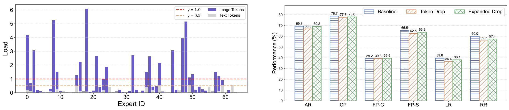

<h1 align="center">[ICLR2026] Capacity-Aware Inference: Mitigating the Straggler Effect in Mixture of Experts</h1>

<p align="center">
  <a href="https://case-lab-umd.github.io/Capacity-Aware-MoE/"></a>
  <a href="https://arxiv.org/abs/2503.05066"></a>
  
  
</p>

<p align="center">
  <a href="https://shwai-he.github.io/">Shwai He</a>, <a href="https://withinmiaov.github.io/">Weilin Cai</a>, <a href="https://jyhuang91.github.io/">Jiayi Huang</a>, <a href="https://www.ang-li.com/">Ang Li</a>
</p>

<p align="center">
  <a href="https://case-lab-umd.github.io/Capacity-Aware-MoE/">🌐 Homepage</a> •
  <a href="#-introduction">📖 Introduction</a> •
  <a href="#-why-this-repo">✨ Why</a> •
  <a href="#-core-methods">🔍 Methods</a> •
  <a href="#-quick-start">🚀 Quick Start</a> •
  <a href="#-repro-checklist">✅ Repro</a> •
  <a href="#-citation">📄 Citation</a>
</p>

## 📖 Introduction

This is the official implementation of the paper [**Capacity-Aware Inference: Mitigating the Straggler Effect in Mixture of Experts**](https://arxiv.org/abs/2503.05066), published in *International Conference on Learning Representations (ICLR) 2026*. We provide a practical inference-time framework for balancing expert load in Mixture-of-Experts models and reducing straggler-driven latency without retraining.

<p align="center">
  
</p>

## 📰 News
- Jan 2026: Capacity-Aware Inference accepted at **ICLR 2026**.
- Mar 2025: Paper and code released.

## ✨ Why This Repo
In sparse MoE models, only a subset of experts is activated per token. This improves parameter efficiency, but under expert parallelism, token routing can become highly imbalanced.

When a few experts are overloaded, all other devices wait for the slowest experts to finish, causing global latency inflation (the **straggler effect**).

This repo provides inference-time solutions that improve balance and throughput with minimal quality impact.

## 🔍 Core Methods
We implement two complementary strategies:

1. **Capacity-Aware Token Drop**
   - Enforces per-expert capacity constraints.
   - Drops overflow tokens routed to overloaded experts.
   - Target: lower tail latency with small performance loss.

2. **Capacity-Aware Expanded Drop**
   - Expands candidate routing to nearby lower-load experts before dropping.
   - Improves expert utilization and smooths load distribution.
   - Target: better throughput-efficiency tradeoff than direct dropping.

### Capacity Control
We regulate expert load using a capacity factor `γ`:

`C = γ * N̄`

- `C`: max tokens assigned to each expert (expert capacity)
- `N̄`: mean token load per expert
- `γ`: capacity factor used at inference time (`EXPERT_CAPACITY` in scripts)

Lower `γ` reduces overload and latency more aggressively, while higher `γ` retains more routed tokens.

<p align="center">
  &nbsp;&nbsp;
  
</p>

## 🧠 Contributions
1. We identify and formalize the **Straggler Effect** in MoE inference under expert parallelism, where overloaded experts dominate end-to-end latency.
2. We propose **Capacity-Aware Token Drop**, a simple inference-time strategy that bounds expert overload with minimal quality impact.
3. We propose **Capacity-Aware Expanded Drop**, which leverages underused local experts before dropping, improving both balance and efficiency.

## 📦 Repository Structure
- `modeling_hf/`: modified Hugging Face MoE modeling files.
- `capacity_aware/`: top-level entry for the generic capacity-aware patch (runtime code is under `lm-evaluation-harness/lm_eval/capacity_aware/`).
- `lm-evaluation-harness/`: language evaluation pipeline and scripts.
- `VLMEvalKit/`: multimodal evaluation pipeline.
- `docs/Figures/`: method and effect visualizations.
- `requirements.txt`: pinned root dependencies.

## ⚙️ Installation
```bash
conda create -n capacity-moe python=3.10 -y
conda activate capacity-moe

pip install -r requirements.txt
```

## 🚀 Quick Start
### 1) Baseline Evaluation
```bash
cd lm-evaluation-harness
bash runs_prune/eval_baseline.sh
```

### 2) Capacity-Aware Evaluation
```bash
cd lm-evaluation-harness
bash runs_prune/eval_capacity.sh
```

Both scripts support environment variable overrides such as `CUDA_VISIBLE_DEVICES`, `PRETRAINED`, `OUTPUT_PATH`, `BATCH_SIZE`, `EXPERT_CAPACITY`, and `STRATEGY`.

### 3) Quick Demo
```bash
cd lm-evaluation-harness
PRETRAINED=./models/deepseek-moe-16b-base-temp \
EXPERT_CAPACITY=1.0 \
STRATEGY=score \
bash runs_prune/eval_capacity.sh
```

Expected outputs are written under:
`$PRETRAINED/expert_capacity-$EXPERT_CAPACITY/$STRATEGY/`

## 🧪 Evaluation Notes
- Install evaluation dependencies first:
  ```bash
  cd lm-evaluation-harness
  pip install -e .
  ```
- **Language benchmarks** are run through `lm_eval` in `lm-evaluation-harness`.
- **Multimodal benchmarks** are supported via `VLMEvalKit`.
- This repo focuses on **inference-time** routing/control under fixed checkpoints.

## 📈 Reported Effect
### 1) Main Results

<p align="center">
  
</p>

- Main comparison across baseline, Token Drop, and Expanded Drop under different capacity settings.
- **Takeaway**: Expanded Drop generally improves or preserves quality while delivering strong speedup.

### 2) Inference Speedup

Expanded Drop is often stronger than direct drop because it first uses low-load local experts, then applies local capacity constraints.
This behavior generally improves utilization and reduces synchronization bottlenecks.

<p align="center">
  
</p>

- Layer-level speedup under different capacity-aware settings across multiple MoE models (e.g., up to ~30% on OLMoE-Instruct and ~1.85x on Mixtral-8x7B-Instruct).

### 3) Multimodal Applicability

Our capacity-aware inference methods are also effective for multimodal MoE models.

<p align="center">
  
</p>

- Multimodal result on **MMBench performance**, comparing Baseline, Token Drop, and Expanded Drop.

The methods are validated on both language and multimodal MoE models.
For exact setup and complete numbers, refer to the paper and evaluation scripts in this repo.

## ✅ Repro Checklist
- Environment: Python 3.10, dependency install via `pip install -r requirements.txt`.
- Model path: set `PRETRAINED` to a local checkpoint path.
- Hardware: set `CUDA_VISIBLE_DEVICES` and verify available GPU memory.
- Script: baseline with `runs_prune/eval_baseline.sh`, capacity-aware with `runs_prune/eval_capacity.sh`.
- Key knobs: `EXPERT_CAPACITY`, `STRATEGY`, `BATCH_SIZE`.

## 📄 Citation
If this repository is useful for your work, please cite:

```bibtex
@misc{he2025capacityawareinferencemitigatingstraggler,
  title={Capacity-Aware Inference: Mitigating the Straggler Effect in Mixture of Experts},
  author={Shwai He and Weilin Cai and Jiayi Huang and Ang Li},
  year={2025},
  eprint={2503.05066},
  archivePrefix={arXiv},
  primaryClass={cs.LG},
  url={https://arxiv.org/abs/2503.05066}
}
```
