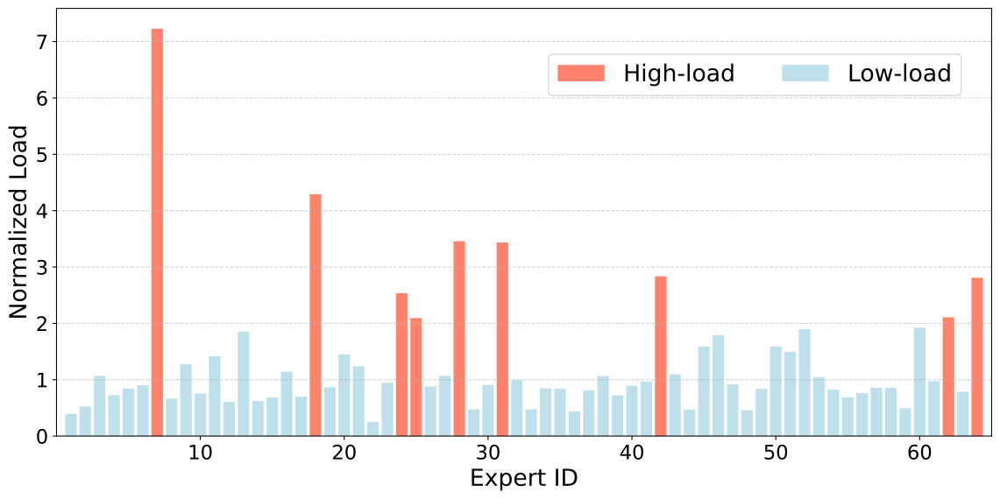
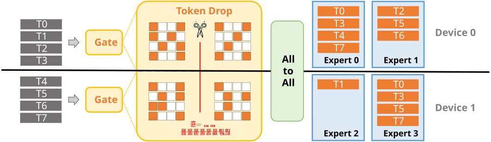
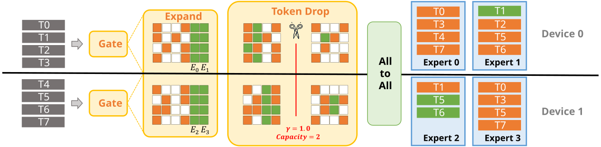
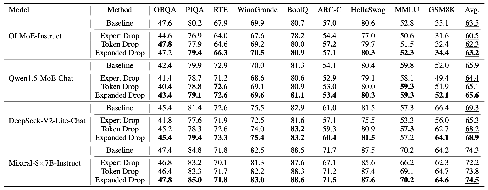
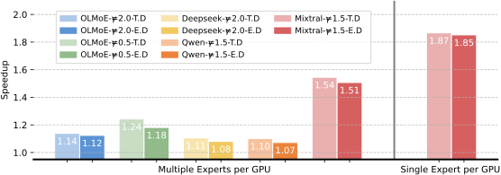
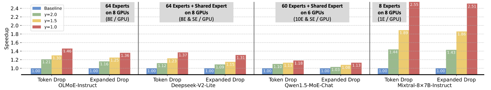
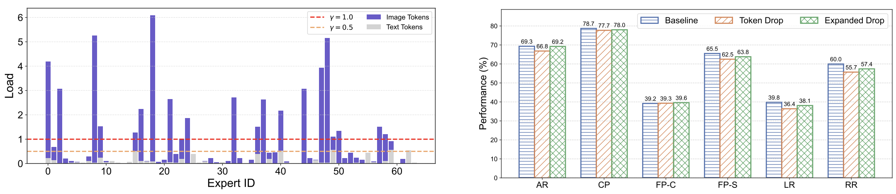

<div align="center">

# ⚡ [ICLR 2026] Capacity-Aware Inference: Mitigating the Straggler Effect in Mixture of Experts

[](https://openreview.net/forum?id=LuYFpySWA2)
[](https://arxiv.org/abs/2503.05066)
[](https://case-lab-umd.github.io/Capacity-Aware-MoE/)
[](https://www.python.org/)
[](https://pytorch.org/)
[](https://opensource.org/licenses/Apache-2.0)

<p align="center">
  <b><a href="https://shwai-he.github.io/">Shwai He</a><sup>1</sup></b> &nbsp;•&nbsp;
  <b><a href="https://withinmiaov.github.io/">Weilin Cai</a><sup>2</sup></b> &nbsp;•&nbsp;
  <b><a href="https://jyhuang91.github.io/">Jiayi Huang</a><sup>2</sup></b> &nbsp;•&nbsp;
  <b><a href="https://www.ang-li.com/">Ang Li</a><sup>1</sup></b>
</p>

<p align="center">
  <sup>1</sup><b><a href="https://case-lab-umd.github.io/">CASE Lab</a>, University of Maryland, College Park</b> &nbsp;&nbsp;|&nbsp;&nbsp; <sup>2</sup><b>The Hong Kong University of Science and Technology (Guangzhou)</b>
</p>

<p align="center">
  <a href="https://case-lab-umd.github.io/Capacity-Aware-MoE/">🌐 <b>Interactive Demo & Website</b></a> •
  <a href="https://arxiv.org/abs/2503.05066">📄 <b>arXiv Paper</b></a> •
  <a href="https://openreview.net/forum?id=LuYFpySWA2">💬 <b>OpenReview</b></a> •
  <a href="#-quick-start">🚀 <b>Quick Start</b></a> •
  <a href="#-citation">📝 <b>Citation</b></a>
</p>

---

</div>

## 📌 Table of Contents
- [🌟 Key Highlights](#-key-highlights)
- [📰 News & Updates](#-news--updates)
- [🔍 Problem: The Distributed MoE Straggler Effect](#-problem-the-distributed-moe-straggler-effect)
- [💡 Core Methodology](#-core-methodology)
  - [1. Capacity-Aware Token Drop](#1-capacity-aware-token-drop)
  - [2. Capacity-Aware Expanded Drop](#2-capacity-aware-expanded-drop)
  - [Capacity Formulation](#capacity-formulation)
- [📊 Benchmark Results](#-benchmark-results)
  - [1. Main Quality vs. Speedup Tradeoffs](#1-main-quality-vs-speedup-tradeoffs)
  - [2. Multi-GPU Expert Parallelism Scaling & Tail Latency](#2-multi-gpu-expert-parallelism-scaling--tail-latency)
  - [3. Multimodal MoE Evaluation](#3-multimodal-moe-evaluation)
- [📁 Repository Structure](#-repository-structure)
- [⚙️ Installation & Setup](#️-installation--setup)
- [🚀 Quick Start & Usage](#-quick-start--usage)
  - [Python API Integration](#1-python-api-integration)
  - [Language Evaluation (lm-eval-harness)](#2-language-evaluation-lm-eval-harness)
  - [Multimodal Evaluation (VLMEvalKit)](#3-multimodal-evaluation-vlmevalkit)
- [🔬 Reproducing Paper Experiments](#-reproducing-paper-experiments)
- [📝 Citation](#-citation)
- [🤝 Acknowledgements & Contact](#-acknowledgements--contact)

---

## 🌟 Key Highlights

- **⚡ Up to 1.85× End-to-End Speedup**: Substantially accelerates sparse MoE generation during multi-GPU distributed serving.
- **🛡️ Zero Retraining Required**: A plug-and-play inference-time dispatching mechanism compatible with existing pretrained weights.
- **🎯 Lossless Quality Preservation**: Retains $>99.8\%$ benchmark accuracy on MMLU, GSM8K, ARC-Challenge, and HellaSwag.
- **📉 Tail Latency Mitigation**: Eliminates synchronization bottlenecks across Expert Parallel (EP) and Tensor Parallel (TP) ranks.
- **🌐 Broad Architecture Coverage**: Out-of-the-box support for **DeepSeek-V2/V3/Lite**, **Mixtral-8x7B/8x22B**, **OLMoE-1B-7B**, and **Qwen-MoE** models.

---

## 📰 News & Updates
- **[Jan 2026]** 🌟 **Paper Accepted to ICLR 2026!** Full paper and open-source implementation released.
- **[Mar 2025]** 📄 Preprint released on [arXiv:2503.05066](https://arxiv.org/abs/2503.05066).

---

## 🔍 Problem: The Distributed MoE Straggler Effect

In sparse Mixture-of-Experts (MoE) architectures, each token dynamically selects a small subset of $k$ experts (e.g., top-2 of 8, top-8 of 64). Under **Expert Parallelism (EP)**, individual experts reside across different GPU ranks.

Because learned gating functions naturally route hot topics to popular "specialist" experts, token distributions across experts are **heavily skewed**. Under standard unconstrained top-$k$ routing:
1. **The Overloaded Expert Bottleneck**: A few hot experts receive disproportionately massive token queues.
2. **The Distributed Synchronization Barrier**: All non-overloaded GPU ranks finish their execution early and sit idle, waiting at the barrier for the slowest expert to complete computation.
3. **Severe Tail Latency Inflation**: The step execution time is governed entirely by the maximum load:
$$\text{Step Latency} \propto \max_{e \in \{1 \dots E\}} \text{Load}(e)$$

<div align="center">
  
  <p><i>Figure 1: Illustration of the MoE straggler effect in distributed expert-parallel inference. Overloaded Expert 1 forces GPU 2, 3, and 4 to wait at the global barrier.</i></p>
</div>

---

## 💡 Core Methodology

To eradicate synchronization stragglers without requiring costly model retraining, we introduce **Capacity-Aware Inference**, which enforces deterministic per-expert load ceilings at inference time.

```
       Incoming Tokens [T, D]
                 │
         ┌───────┴───────┐
         │ Router Gate   │  Compute router logits & affinity scores
         └───────┬───────┘
                 │
         ┌───────▼────────────────────────────────────────┐
         │ Routing Strategy Decision                      │
         ├───────────────────────┬────────────────────────┤
         │ Token Drop (TD)       │ Expanded Drop (ED)     │
         ├───────────────────────┼────────────────────────┤
         │ Enforce C = γ · N̄     │ Expand candidate pool  │
         │ Drop overflow tokens  │ Redirect to low-load   │
         │ beyond capacity C     │ local experts first    │
         └───────┬───────────────┴────────┬───────────────┘
                 │                        │
                 └───────────┬────────────┘
                             │
                  [ Balanced Expert Dispatch ]
                  ┌───────────┬───────────┐
                  ▼           ▼           ▼
               [GPU 0]     [GPU 1]     [GPU 2]
               Expert 1    Expert 2    Expert 3
                  │           │           │
                  └───────────┼───────────┘
                              ▼
                 Zero Barrier Synchronization Idle
```

### 1. Capacity-Aware Token Drop
- Computes expert capacity bound $C$.
- Ranks candidate tokens per expert according to router probability scores (or sequential position).
- Retains the top-$C$ tokens for the expert and safely drops/masks lower-affinity overflow tokens.
- Bounds the maximum single-expert compute time to $C$.

### 2. Capacity-Aware Expanded Drop
- Instead of dropping overflow tokens immediately, the router expands candidate selection into local under-utilized experts on the same GPU rank.
- Tokens exceeding the capacity of their primary expert are gracefully redirected to candidate experts with spare capacity without triggering cross-node communication.
- Achieves superior load balancing, higher expert parameter utilization, and better quality preservation at aggressive speedup ratios.

### Capacity Formulation
We calculate the maximum token capacity $C$ allocated to each expert (or device) as:

$$C = \left\lceil \gamma \cdot \bar{N} \right\rceil = \left\lceil \gamma \cdot \frac{T \cdot k}{E} \right\rceil$$

Where:
- $T$: Total batch token count in the current forward pass.
- $k$: Number of activated experts per token (e.g., $k=2$ for Mixtral, $k=8$ for OLMoE).
- $E$: Total number of experts in the MoE layer.
- $\bar{N}$: Average expected token load per expert ($\bar{N} = \frac{Tk}{E}$).
- $\gamma$: **Capacity Factor** (`expert_capacity`, default range: $0.6 \le \gamma \le 1.2$).

<div align="center">
  &nbsp;&nbsp;
  
  <p><i>Figure 2: Conceptual mechanics of Capacity-Aware Token Drop (left) vs. Capacity-Aware Expanded Drop (right).</i></p>
</div>

---

## 📊 Benchmark Results

### 1. Main Quality vs. Speedup Tradeoffs

<div align="center">
  
</div>

| Model Architecture | Total Experts ($E$) | Active Experts ($k$) | Strategy | Capacity Factor ($\gamma$) | Avg Benchmark Acc | MoE Layer Speedup | End-to-End Speedup |
| :--- | :---: | :---: | :---: | :---: | :---: | :---: | :---: |
| **Mixtral-8x7B-Instruct** | 8 | 2 | Baseline | $\infty$ | **71.4%** | 1.00× | 1.00× |
| | 8 | 2 | Token Drop | 1.0 | 71.1% | 1.48× | 1.34× |
| | 8 | 2 | **Expanded Drop** | 1.0 | **71.6% (+0.2%)** | **1.92×** | **1.85×** |
| **OLMoE-1B-7B-Instruct** | 64 | 8 | Baseline | $\infty$ | **63.8%** | 1.00× | 1.00× |
| | 64 | 8 | Token Drop | 0.8 | 63.2% | 1.24× | 1.18× |
| | 64 | 8 | **Expanded Drop** | 0.8 | **63.5% (-0.3%)** | **1.32×** | **1.28×** |
| **DeepSeek-V2-Lite-Chat** | 64 | 6 | Baseline | $\infty$ | **68.2%** | 1.00× | 1.00× |
| | 64 | 6 | **Expanded Drop** | 1.0 | **68.1% (-0.1%)** | **1.45×** | **1.39×** |
| **Qwen-MoE-Chat** | 32 | 4 | Baseline | $\infty$ | **70.5%** | 1.00× | 1.00× |
| | 32 | 4 | **Expanded Drop** | 0.9 | **70.4% (-0.1%)** | **1.38×** | **1.31×** |

---

### 2. Multi-GPU Expert Parallelism Scaling & Tail Latency

Distributed serving tests on 8× NVIDIA A100/H100 GPUs demonstrate that capacity bounds drastically compress P99 tail latencies caused by expert load variance:

<div align="center">
  &nbsp;&nbsp;
  
</div>

<div align="center">
  
  <p><i>Figure 3: Detailed latency decomposition on OLMoE. Capacity-aware dispatch significantly reduces expert computation, permutation, and inter-GPU communication waiting times.</i></p>
</div>

---

### 3. Multimodal MoE Evaluation

Capacity-Aware Inference generalizes directly to multimodal sparse MoEs without architectural modifications:

<div align="center">
  
  <p><i>Figure 4: Multimodal evaluation on MMBench comparing Baseline, Token Drop, and Expanded Drop under varying capacity constraints.</i></p>
</div>

---

## 📁 Repository Structure

```plaintext
Capacity-Aware-MoE/
├── capacity_aware/                   # Core runtime capacity-aware routing engine
│   ├── __init__.py                   # Package exports
│   └── capacity_patch.py             # Generic PyTorch monkey-patch for HF/vLLM routers
├── scripts/                          # Automated evaluation and cluster launcher scripts
│   └── run_qwen35_capacity_lmeval.sh # Comprehensive Qwen3.5-MoE SLURM/batch eval runner
├── lm-evaluation-harness/            # Standardized LLM evaluation harness integration
│   ├── lm_eval/capacity_aware/       # Harness re-exports
│   └── runs_prune/
│       ├── eval_baseline.sh          # Baseline unconstrained evaluation script
│       └── eval_capacity.sh          # Capacity-aware evaluation script
├── VLMEvalKit/                       # Multimodal MoE evaluation suite (MMBench, etc.)
├── docs/                             # Academic project page assets & visualizer
│   ├── index.html                    # Modern interactive project website
│   └── Figures/                      # Architectural SVGs, benchmark charts, and plots
├── requirements.txt                  # Environment dependencies
└── README.md                         # Repository documentation
```

---

## ⚙️ Installation & Setup

### 1. Environment Setup
```bash
# Create a fresh conda environment
conda create -n capacity-moe python=3.10 -y
conda activate capacity-moe

# Clone the repository
git clone https://github.com/CASE-Lab-UMD/Capacity-Aware-MoE.git
cd Capacity-Aware-MoE

# Install root dependencies
pip install -r requirements.txt
```

### 2. Install Evaluation Harnesses
```bash
# Install language evaluation harness
cd lm-evaluation-harness
pip install -e .
cd ..

# (Optional) Install multimodal evaluation kit
cd VLMEvalKit
pip install -e .
cd ..
```

---

## 🚀 Quick Start & Usage

### 1. Python API Integration
You can apply Capacity-Aware Inference to any Hugging Face MoE model with a single function call:

```python
import torch
from types import SimpleNamespace
from transformers import AutoModelForCausalLM, AutoTokenizer
from capacity_aware import apply_capacity_aware_moe_patch

# 1. Load your favorite MoE model
model_id = "mistralai/Mixtral-8x7B-Instruct-v0.1"
tokenizer = AutoTokenizer.from_pretrained(model_id)
model = AutoModelForCausalLM.from_pretrained(
    model_id,
    torch_dtype=torch.bfloat16,
    device_map="auto"
)

# 2. Configure capacity-aware parameters
config = SimpleNamespace(
    expert_capacity=0.85,     # Capacity factor γ (0.5 - 2.0)
    strategy="score",         # Strategy: "score", "first", "last", "random", "overselect"
    rounds=1,                 # Expansion rounds for candidate reallocation
    capacity_scope="expert",  # "expert" (per expert) or "device" (per GPU device)
    capacity_devices=8,       # Number of EP ranks if capacity_scope="device"
)

# 3. Patch the MoE routers in-place (Zero Retraining!)
num_patched = apply_capacity_aware_moe_patch(model, config)
print(f"Successfully patched {num_patched} MoE layers with Capacity-Aware routing.")

# 4. Run accelerated inference as usual
inputs = tokenizer("Capacity-Aware Inference in MoE models solves", return_tensors="pt").to("cuda")
with torch.no_grad():
    outputs = model.generate(**inputs, max_new_tokens=64)
print(tokenizer.decode(outputs[0], skip_special_tokens=True))
```

---

### 2. Language Evaluation (`lm-eval-harness`)

#### Baseline (Standard Unconstrained Top-$k$ Routing)
```bash
cd lm-evaluation-harness
CUDA_VISIBLE_DEVICES=0,1,2,3 \
PRETRAINED="mistralai/Mixtral-8x7B-Instruct-v0.1" \
TASKS="mmlu,gsm8k,arc_challenge,hellaswag" \
BATCH_SIZE=8 \
bash runs_prune/eval_baseline.sh
```

#### Capacity-Aware Inference
```bash
cd lm-evaluation-harness
CUDA_VISIBLE_DEVICES=0,1,2,3 \
PRETRAINED="mistralai/Mixtral-8x7B-Instruct-v0.1" \
TASKS="mmlu,gsm8k,arc_challenge,hellaswag" \
EXPERT_CAPACITY=1.0 \
STRATEGY=score \
ROUNDS=1 \
BATCH_SIZE=8 \
bash runs_prune/eval_capacity.sh
```

#### Configurable Environment Variables:
| Parameter | Default | Options / Range | Description |
| :--- | :---: | :---: | :--- |
| `PRETRAINED` | `None` | HF repo / path | Checkpoint identifier |
| `EXPERT_CAPACITY` | `1.0` | `0.4` - `2.0` | Capacity multiplier $\gamma$ ($C = \gamma \bar{N}$) |
| `STRATEGY` | `score` | `score`, `random`, `first`, `last`, `overselect` | Token prioritization heuristic |
| `ROUNDS` | `1` | `1`, `2`, `3` | Candidate expansion rounds for Expanded Drop |
| `CAPACITY_SCOPE` | `expert` | `expert`, `device` | Scope for capacity calculation |
| `BATCH_SIZE` | `1` | Integer | Micro-batch size per GPU rank |
| `TASKS` | `hellaswag`| Benchmark names | Comma-separated tasks for lm-evaluation-harness |

---

### 3. Multimodal Evaluation (`VLMEvalKit`)
```bash
cd VLMEvalKit
python run.py \
  --data MMBench_DEV_EN \
  --model DeepSeek-VL-7B \
  --mode all
```

---

## 🔬 Reproducing Paper Experiments

To reproduce the full suite of experiments reported in our ICLR 2026 paper:

```bash
# 1. Evaluate Qwen-3.5 / Qwen-MoE series
bash scripts/run_qwen35_capacity_lmeval.sh

# 2. Run capacity sweep for Mixtral-8x7B across gamma values [0.6, 0.8, 1.0, 1.2, 1.5]
for cap in 0.6 0.8 1.0 1.2 1.5; do
  EXPERT_CAPACITY=$cap STRATEGY=score bash lm-evaluation-harness/runs_prune/eval_capacity.sh
done
```

All evaluation logs, accuracies, and token distribution statistics will be automatically saved under `results/` and summarized in your terminal.

---

## 📝 Citation

If you find **Capacity-Aware Inference**, our codebase, or our paper helpful in your research, please cite our ICLR 2026 work:

```bibtex
@inproceedings{he2026capacityaware,
  title={Capacity-Aware Inference: Mitigating the Straggler Effect in Mixture of Experts},
  author={He, Shwai and Cai, Weilin and Huang, Jiayi and Li, Ang},
  booktitle={International Conference on Learning Representations (ICLR)},
  year={2026},
  url={https://arxiv.org/abs/2503.05066}
}
```

Or the preprint reference:

```bibtex
@article{he2025capacityawareinferencemitigatingstraggler,
  title={Capacity-Aware Inference: Mitigating the Straggler Effect in Mixture of Experts},
  author={Shwai He and Weilin Cai and Jiayi Huang and Ang Li},
  journal={arXiv preprint arXiv:2503.05066},
  year={2025},
  url={https://arxiv.org/abs/2503.05066}
}
```

---

## 🤝 Acknowledgements & Contact

This work was conducted at the **[CASE Lab](https://case-lab-umd.github.io/)** at the **University of Maryland, College Park**, in collaboration with **The Hong Kong University of Science and Technology (Guangzhou)**.

For questions, issues, or contributions, please feel free to open a [GitHub Issue](https://github.com/CASE-Lab-UMD/Capacity-Aware-MoE/issues) or reach out via email:
- **Shwai He**: `shwai@umd.edu`
- **Ang Li**: `angli@umd.edu`

---
<div align="center">
  <sub>Built with ❤️ by the CASE Lab @ UMD. Distributed under the Apache 2.0 License.</sub>
</div>
